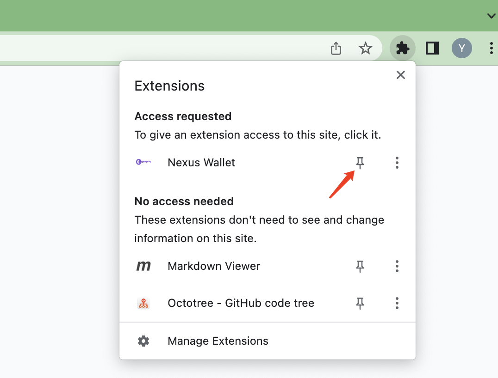
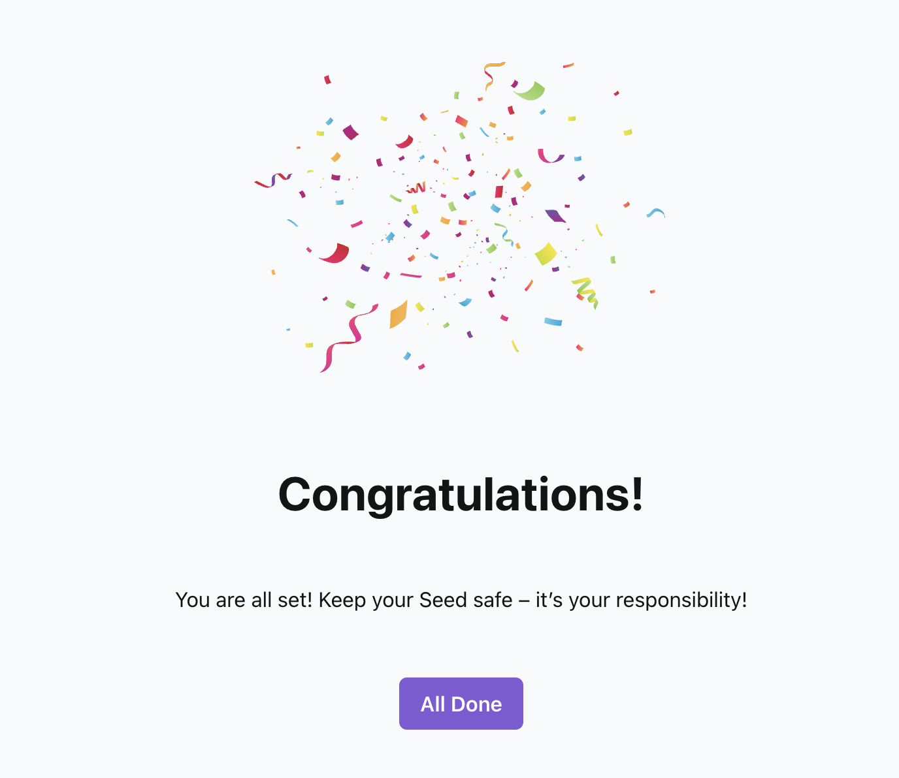
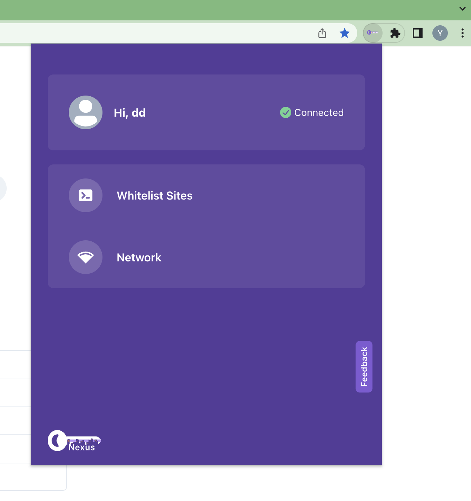
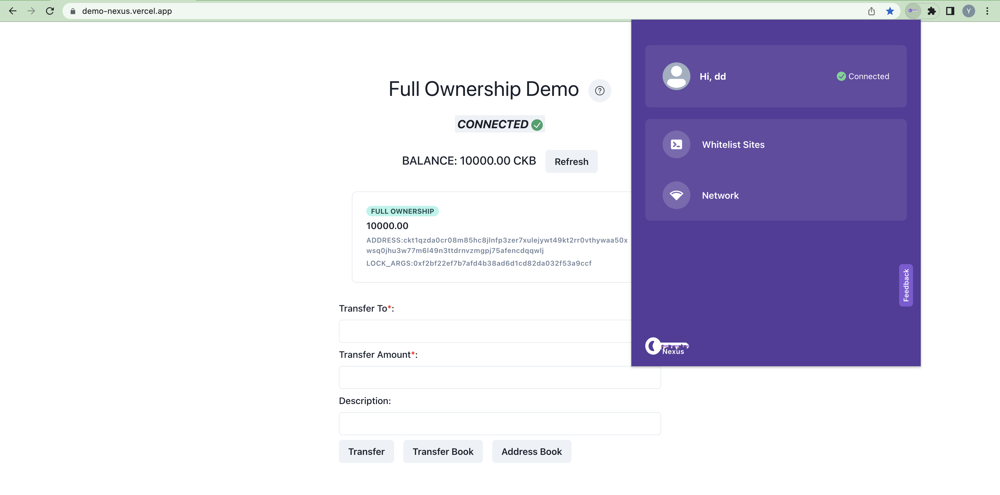

# Tutorial

Nexus Wallet is a UTXO friendly wallet for CKB.

It is designed not only for end users but also for DApp builders.

It is a Chrome extension that end users can use to connect to DApps and sign transactions or messages.

It also provides a set of APIs for DApp builders to interact with the wallet.

---

## For Nexus Wallet Users

This part is for you if you are a Nexus Wallet user, the following section will guide you to install the Nexus Wallet and initialize it.

---

You can clone the repo and build the Nexus Wallet, then install the Nexus extension on Chrome by the instructions [here](https://developer.chrome.com/docs/extensions/mv3/getstarted/development-basics/).

---

### Initialize the Nexus Wallet

---

After installing the Nexus extension, you can open the Nexus Wallet and initialize the Nexus Wallet.

Firstly, you can pin the Nexus Wallet to the Chrome taskbar by clicking the pin icon on the top right corner of the browser.



Then you can open the Nexus Wallet initialization page by clicking the Nexus icon on the Chrome taskbar.


By clicking the Nexus icon, you will be navigated to the Nexus Wallet welcome page.


Then you have a set of mnemonics, click `Import Wallet` button, otherwise, click the `Create a Wallet` button. Follow the instructions on the page to initialize the Nexus Wallet, when you see the page below, now you are all set.



---

### Try it out

---

What you can do next is to go to your favorite dApp and try it out. Or click the Nexus icon on the Chrome taskbar to open the Nexus Wallet and view your profile.



A [Dapp Demo](https://demo-nexus.vercel.app/) which supports Nexus is also available.



---

## For DApp Developers

This part is for you if you are a DApp developer, the following section introduces the APIs that Nexus provides for DApp developers, and some examples demonstrating how to use the APIs.

---

### The RPC interface

---

As described in the [arch](./arch.md) article, Nexus provides a JSON-RPC interface for the dApp to interact with the Nexus Wallet.

The pattern of calling the JSON-RPC interface is as follows:

```js
await ckb.request({
  method: <REQUEST_METHOD_NAME>,
  params: <PARAMS_OF_REQUEST>,
})
```

The request method name could be one of the following:

- wallet_enable
- wallet_fullOwnership_getOffChainLocks
- wallet_fullOwnership_getOnChainLocks
- wallet_fullOwnership_getLiveCells
- wallet_fullOwnership_signData
- wallet_fullOwnership_signTransaction

You can get the full documentation of these request methods [here](./rpc.md).

---

### Concepts

---

#### Ownership

---

Full ownership means some locks or cells that are under full control of the wallet. Users can spend the cells or sign the data with the locks as they want.

In contrast, rule-based ownership means some locks or cells that are under partial control of the wallet. Users can only spend the cells or sign the data with the locks under certain conditions.

Currently, Nexus only supports full ownership. And the full ownership only supports secp256k1 lock for now.

---

#### Off-chain/On-chain Locks

---

Once the user has initialized the Nexus Wallet, the Nexus Wallet will derive locks for the user. These locks may have some transactions on the CKB chain, or not.

Off-chain locks are the locks that have no transactions on the CKB chain. On-chain locks are the locks that have some transactions on the CKB chain.

Thus off-chain locks are never used on the CKB chain. For privacy reasons, we suggest users use off-chain locks to receive CKB or tokens, this is one big advantage of UTXO model compared to the account model.

---

#### External/Internal Locks

---

External locks are used to receive CKB or tokens from other users. Internal locks are used to receive CKB or token changes from the transactions that are initiated by the user.

---

#### Live Cells

---

Live Cells are the cells that are alive on the CKB chain, they can be spent by the controller of its lock. It's just another name for Unspent-Transaction-Output (UTXO).

---

### Issue a transfer transaction with the Nexus Wallet

---

#### Step 1: Enable the Nexus Wallet

---

Firstly, you need to enable the Nexus Wallet by calling the `wallet_enable` RPC.

If your dApp is the first time to connect to the wallet,
you'll need to call `wallet_enable` API to enable the wallet for the dApp.
After calling this method, we can see the dApp in the whitelist

```js
await window.ckb.request({ method: 'wallet_enable' });
```

---

#### Step 2: Get one off-chain lock and receive some testnet CKB

---

Then you can get the off-chain locks by calling the `wallet_fullOwnership_getOffChainLocks` RPC.

```js
const offChainLocks = await window.ckb.request({
  method: 'wallet_fullOwnership_getOffChainLocks',
  params: { change: 'external' },
});
const lock = offChainLocks[0];
const address = helpers.encodeToAddress(lock);
```

Then you can use the address to receive some testnet CKB from the [CKB Faucet](https://faucet.nervos.org/).

After you have received the testnet CKB, the lock that used to receive the CKB will become an on-chain lock.

---

#### Step 3: Get the live cells and build a transfer transaction

---

Now that you 10000 CKB, let's transfer 100 CKB to another address.

We can get the live cells by calling the `wallet_fullOwnership_getLiveCells` RPC.

```typescript
// use an external lock to receive the CKB
const externalOffChainLocks = await window.ckb.request({
  method: 'wallet_fullOwnership_getOffChainLocks',
  params: { change: 'external' },
});
const receiveLock = externalOffChainLocks[0];
// use an external lock to receive the CKB change
const internalOffChainLocks = await window.ckb.request({
  method: 'wallet_fullOwnership_getOffChainLocks',
  params: { change: 'internal' },
});
const changeLock = internalOffChainLocks[0];
// get the live cells to spend
const getLiveCellsRes = await window.ckb.request({
  method: 'wallet_fullOwnership_getLiveCells',
  params: {},
});
const liveCells: Cell[] = getLiveCellsRes.objects;
const totalCapacity = liveCells.reduce((acc, cell) => acc.add(cell.cellOutput.capacity), BigInt(0));
let txSkeleton = helpers.TransactionSkeleton({
  cellProvider: new Indexer('https://testnet.ckb.dev'),
});
// setup inputs
txSkeleton = txSkeleton.update('inputs', (inputs) => {
  return inputs.concat(...liveCells);
});
// setup outputs
txSkeleton = txSkeleton.update('outputs', (outputs) => {
  return outputs.concat(
    // transfer 100 CKB to the receivelock
    {
      cellOutput: {
        capacity: BI.from(100)
          .mul(10 ** 8)
          .toHexString(),
        lock: receiveLock,
      },
      data: '0x',
    },
    // receive change CKB
    {
      cellOutput: {
        capacity: totalCapacity
          .sub(BI.from(100).mul(10 ** 8))
          .sub(1000) // 1000 shannons for tx fee
          .toHexString(),
        lock: changeLock,
      },
      data: '0x',
    },
  );
});

// to build the transaction, there are still some other things to do
// fill in cellDeps, placeholder witnesses, etc.
```

---

#### Step 4: Sign the transaction and send it to the CKB chain

---

After you have built the transactionSkeleton, you can sign the transaction by calling the `wallet_fullOwnership_signTransaction` RPC.

```typescript
// sign the transaction with Nexus Wallet RPC
const tx = helpers.createTransactionFromSkeleton(txSkeleton);
const signatures: [Script, HexString] = await ckb.fullOwnership.signTransaction({ tx });
// put signatures into witnesses
for (let index = 0; index < signatures.length; index++) {
  const [_, sig] = signatures[index];
  tx.witnesses[index] = bytes.hexify(blockchain.WitnessArgs.pack({ lock: sig }));
}
// send the transaction
const txHash = await rpc.sendTransaction(tx);
```

---

### Other references

---

You can find a complete demo of transferring CKB with the Nexus Wallet in [Nexus-Demo](https://github.com/zhangyouxin/demo-nexus/blob/main/pages/index.tsx#L140-L246)
